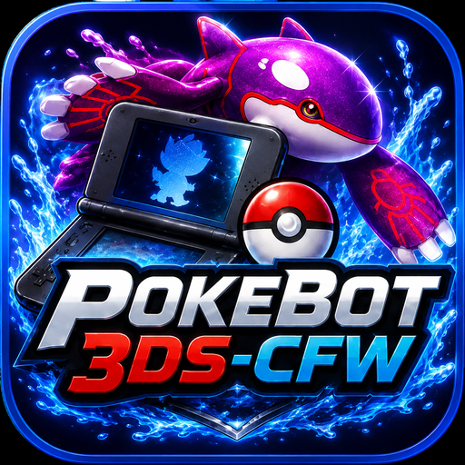

# POKEBOT3DS-CFW — Windows EXE Release

<p align="center">
  
</p>
<p align="center">
  <strong>Standalone Windows build for Pokémon Alpha Sapphire</strong>
</p>
inspiration taken from
# https://github.com/wyanido/pokebot-nds/
# https://github.com/40cakes/pokebot-gen3
# https://github.com/PokemonAutomation

> [!IMPORTANT]
> **This release is currently for Pokémon Alpha Sapphire only.**
>
> **English is the only in-game language currently hardware verified.**
> Other languages are not yet claimed as supported.

---

## Do I need Python?

**No.**

If you downloaded the finished **POKEBOT3DS-CFW Windows EXE release**, you do **not** need to install:

- Python
- pip
- PySide6
- Qt
- PyInstaller
- `RUN_REQUIREMENTS.bat`
- any Python package from `requirements.txt`

The release is built with **PyInstaller in `onedir` mode**. The Python interpreter,
PySide6/Qt libraries, and the Python modules used by POKEBOT3DS-CFW are bundled
inside the application folder.

### Important: keep the whole folder

POKEBOT3DS-CFW is intentionally distributed as a folder-based application.

A typical release looks like:

```text
POKEBOT3DS-CFW/
├─ POKEBOT3DS-CFW.exe
├─ _internal/
├─ assets/
├─ 3ds_sd/
│  ├─ boot.firm
│  └─ luma/
│     └─ titles/
│        └─ 000400000011C500/
│           └─ code.ips
├─ HOW_TO_USE.txt
└─ README.md
```

**Do not move `POKEBOT3DS-CFW.exe` out of this folder and do not delete
`_internal`.**

The EXE depends on the bundled files beside it.

---

## What you still need

The standalone EXE removes the need for Python and PC-side dependency setup.

You still need:

- a compatible Nintendo 3DS with the required custom firmware setup
- the supplied **custom Nexus3DS-based `boot.firm`**
- the supplied Pokémon Alpha Sapphire `code.ips`
- game patching enabled
- InputRedirection enabled
- the PC and 3DS on the same local network
- Pokémon Alpha Sapphire
- the correct 3DS IP address entered in POKEBOT3DS-CFW

The EXE does **not** automatically install `boot.firm` or `code.ips`.

Those remain manual SD-card setup files.

---

## Firmware used by POKEBOT3DS-CFW

POKEBOT3DS-CFW does **not** use a stock Luma3DS `boot.firm`.

The supplied firmware is based on **Nexus3DS CFW**, with custom POKEBOT3DS-CFW
modifications that add a **read-only RAM bridge** for the game.

### Network services

| Function | Port |
|---|---:|
| POKEBOT3DS-CFW read-only RAM bridge | UDP **4952** |
| Nexus3DS/Luma-derived InputRedirection | UDP **4950** |

RAM is used as the authority for Pokémon encounter and shiny decisions.

The bot does not use OCR or image recognition as shiny authority.

---

## First-time 3DS setup

### 1. Back up your SD card

Before replacing firmware or adding patches, make a backup of important SD-card
files and save data.

### 2. Install the supplied `boot.firm`

The release contains:

```text
3ds_sd\boot.firm
```

Copy it to the root of the 3DS SD card:

```text
SD:\boot.firm
```

Back up the previous `boot.firm` first.

### 3. Install the Alpha Sapphire patch

Copy:

```text
3ds_sd\luma\titles\000400000011C500\code.ips
```

to:

```text
SD:\luma\titles\000400000011C500\code.ips
```

The current patch is for **Pokémon Alpha Sapphire only**.

### 4. Enable game patching

1. Fully power off the 3DS.
2. Hold **SELECT**.
3. While still holding SELECT, power on the 3DS.
4. In the Nexus3DS/Luma-derived configuration menu, enable **game patching**.
5. Save and exit.

### 5. Start InputRedirection

After booting the 3DS:

1. Start Pokémon Alpha Sapphire.
2. Open Rosalina using **L + D-Pad Down + Select**.
3. Open **Miscellaneous options**.
4. Start **InputRedirection**.
5. Exit Rosalina and return to the game.

---

## Starting POKEBOT3DS-CFW

There is no dependency installer to run for the finished EXE release.

Simply double-click:

```text
POKEBOT3DS-CFW.exe
```

The application uses the standard native Windows frame with:

- minimise
- maximise / restore
- close
- normal title-bar dragging
- normal window resizing

---

## Configure the bot

In **Settings**, confirm:

- your 3DS IP address
- RAM bridge port: `4952`
- InputRedirection port: `4950`
- whether `code.ips` is ON or OFF

For the bundled validated Alpha Sapphire setup, select the setting that matches
the patch actually installed on the SD card.

### `code.ips` ON

Expected reset route:

```text
Reset
→ Title
→ Continue
→ Field / Birch Bag
```

Communication-error dismissal is disabled in this mode.

If the environment does not match the expected RAM state, the bot should HOLD
rather than blindly press through it.

### `code.ips` OFF

Expected reset route:

```text
Reset
→ Title
→ Continue
→ Communication Error
→ RAM-confirmed dismissal
→ Field / Birch Bag
```

The bot uses bounded, RAM-gated communication-error recovery.

---

## Supported hunts

Current production scope:

- Treecko starter
- Torchic starter
- Mudkip starter

Current game:

- **Pokémon Alpha Sapphire**

Current verified language:

- **English**

Not currently verified:

- Japanese
- French
- German
- Italian
- Spanish
- Korean
- Omega Ruby
- XY
- Sun / Moon
- Ultra Sun / Ultra Moon

---

## RAM shiny safety

POKEBOT3DS-CFW uses validated PK6 data from game RAM.

For an authoritative encounter, the bot validates the Pokémon data before making
the shiny decision.

Core safety policy:

```text
valid non-shiny → automation may continue
shiny           → absolute HOLD
invalid data    → HOLD
wrong species   → HOLD
checksum error  → HOLD
TID/SID mismatch→ HOLD
RAM/state error → HOLD
```

The bot should never intentionally reset over an authoritative shiny result.

---

## STOP behaviour

**STOP is immediate.**

When Stop is pressed:

- cancellation is requested immediately
- controller state is forced back to neutral
- cancellable route sleeps and state waits stop
- the bot does not deliberately finish the cycle
- the bot does not deliberately return to the Birch bag first

If a bounded UDP RAM request is already waiting for a network reply, the worker
may need to reach that request's configured timeout before it fully exits, but
no new gameplay input should be authorized after Stop.

---

## If the bot HOLDs

A safety HOLD is intentional.

Do not repeatedly restart the bot without checking why it stopped.

Use the support/export function and retain the generated support ZIP so the
failing RAM/state gate can be diagnosed.

A HOLD may indicate:

- unexpected game state
- RAM bridge timeout
- checksum failure
- wrong Pokémon identity
- TID/SID mismatch
- reset-route mismatch
- incorrect `code.ips` setting
- other safety validation failure

---

## Windows SmartScreen / antivirus

Unsigned self-built applications may trigger a Windows SmartScreen warning or
antivirus reputation check.

That is separate from whether Python is installed.

POKEBOT3DS-CFW does not require Python on the end-user PC merely because Windows
shows an unknown-publisher or reputation warning.

Future releases can add Windows code signing if desired.

---

## For developers only

If you are building POKEBOT3DS-CFW from source, then the **build computer**
does need Python and the build dependencies.

Use:

```text
BUILD_EXE.bat
```

The builder creates an isolated build environment, installs the runtime/build
dependencies, and produces:

```text
dist\POKEBOT3DS-CFW\POKEBOT3DS-CFW.exe
```

Normal users should receive the complete finished:

```text
dist\POKEBOT3DS-CFW\
```

folder.

They do not need the source-tree `RUN_REQUIREMENTS.bat`.

---

## Release validation requirement

Before publishing a new EXE build, test the **exact finished release folder** on
a clean Windows system or virtual machine that does **not have Python installed**.

Minimum release smoke test:

- [ ] `POKEBOT3DS-CFW.exe` launches with no Python installed
- [ ] shiny Kyogre icon appears on the EXE
- [ ] icon appears in the native title bar
- [ ] icon appears in the taskbar / Alt+Tab
- [ ] Dashboard opens
- [ ] Hunts page opens
- [ ] Settings page opens
- [ ] settings persist
- [ ] RAM bridge connection test works
- [ ] InputRedirection works
- [ ] assets and shiny sound load
- [ ] support ZIP export works
- [ ] Alpha Sapphire starter hunt can start
- [ ] STOP works
- [ ] no missing-module or missing-DLL error occurs

Only after that clean-machine test should the EXE release be described as
**standalone validated**.

---

## Why there is no `RUN_REQUIREMENTS.bat` in the public EXE release

`RUN_REQUIREMENTS.bat` exists for running the Python source version.

It is unnecessary for the finished PyInstaller application because the
interpreter and required Python modules are bundled with the application.

For GitHub source/development, `requirements.txt` remains useful.

For normal Windows users, the intended experience is:

```text
Extract release
→ configure 3DS
→ double-click POKEBOT3DS-CFW.exe
```

No Python setup step is required.

---

## Current compatibility

| Component | Status |
|---|---|
| Windows standalone EXE architecture | ✅ |
| Python required for end user | ❌ No |
| PySide6 install required for end user | ❌ No |
| `RUN_REQUIREMENTS.bat` required for end user | ❌ No |
| Pokémon Alpha Sapphire | ✅ |
| English language | ✅ Hardware verified |
| Other languages | ⚪ Unverified |
| Omega Ruby | ⚪ Not yet supported |
| Custom Nexus3DS RAM bridge | ✅ |
| InputRedirection UDP 4950 | ✅ |
| RAM bridge UDP 4952 | ✅ |

---

## Important

POKEBOT3DS-CFW is an independent homebrew and automation project.

Keep backups of your SD card and important save data before testing custom
firmware, patches or automation.
