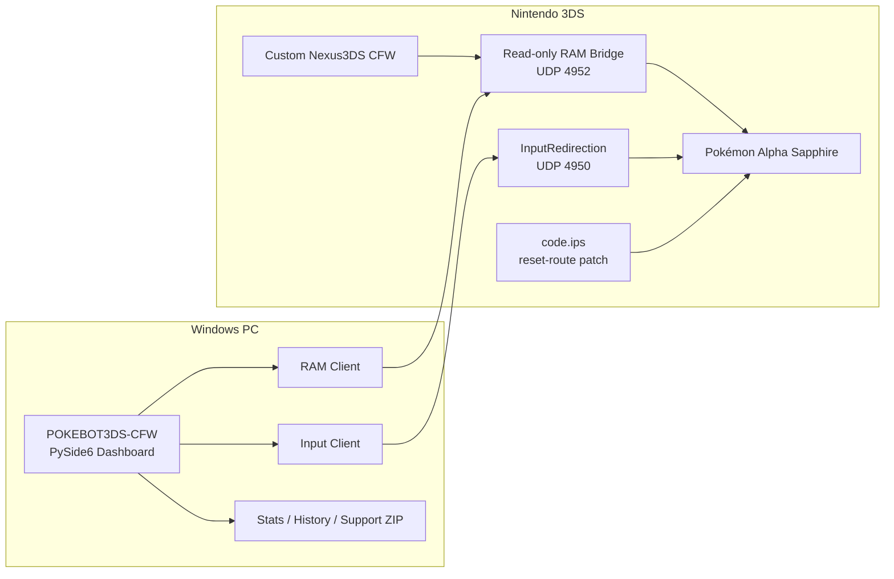

# POKEBOT3DS-CFW

<p align="center">
  
  
  
  
</p>

<p align="center">
  
  
  
  
  
  
</p>

> [!IMPORTANT]
> **POKEBOT3DS-CFW currently supports Pokémon Alpha Sapphire only.**
>
> The current RAM map, starter automation and bundled `code.ips` are validated for **Pokémon Alpha Sapphire — Title ID `000400000011C500`**.
>
> **English is the only in-game language currently hardware verified.** Other languages may prove compatible because the bot is RAM/state based, but they remain **UNVERIFIED** until separately tested.

POKEBOT3DS-CFW is a Windows shiny-hunting bot built around a customised **Nexus3DS CFW** `boot.firm`.

The firmware adds a small **read-only RAM bridge** used by the PC application to inspect Pokémon game state without GDB, RAM writes or OCR-based shiny detection. Controller input remains on the Nexus3DS/Luma-derived **InputRedirection UDP 4950** path.

The current release focuses on **Alpha Sapphire starter hunting** with Treecko, Torchic and Mudkip.

---

## Project progress

### Current Alpha Sapphire starter release

**90%**

```text
██████████████████░░  90%
```

The starter-hunting core is hardware validated. Remaining work in this release scope is mainly final hardware validation of newer convenience behaviour, GitHub/release polish, and further UI pages.

### Wider POKEBOT3DS-CFW roadmap

**38%**

```text
████████░░░░░░░░░░░░  38%
```

The wider roadmap includes Omega Ruby parity, RAM-based wild hunts, static encounters, additional games, and broader language validation.

> Percentages are roadmap estimates, not automated code-coverage metrics.

### Feature status

| Area | Progress | Status |
|---|---:|---|
| Nexus3DS read-only RAM bridge | **100%** | ✅ Hardware proven |
| Alpha Sapphire RAM mapping | **100%** | ✅ Proven |
| Torchic starter backend | **100%** | ✅ 10/10 baseline proven |
| Treecko starter backend | **100%** | ✅ 10/10 baseline proven |
| Mudkip starter backend | **100%** | ✅ 10/10 baseline proven |
| `code.ips` ON reset route | **100%** | ✅ 34/34 Torchic validation |
| PK6 validation + shiny authority | **100%** | ✅ RAM authoritative |
| Qt dashboard core | **80%** | 🟢 Dashboard / Hunts / Settings live |
| Stats / encounter history | **80%** | 🟢 Core persistence live |
| Immediate Stop behaviour | **75%** | 🟡 Implemented; wider hardware stop-point validation pending |
| GitHub/setup documentation | **90%** | 🟢 Main setup flow documented |
| Alpha Sapphire language validation | **14%** | 🟡 English 1/7 verified |
| Omega Ruby RAM parity | **0%** | ⚪ Not started |
| RAM-based wild hunting | **10%** | ⚪ Architecture planned / early authority known |
| RAM-based static hunting | **0%** | ⚪ Deferred |
| XY / Gen 7 support | **0%** | ⚪ Future roadmap |

---

## What makes this different?

POKEBOT3DS-CFW treats **validated game RAM as the source of truth**.

It does **not** use screen OCR or image matching to decide whether a Pokémon is shiny.

For every authoritative encounter:

1. The bot reaches a RAM-confirmed game-state boundary.
2. It performs a bounded read of the relevant PK6 data.
3. PK6 checksum and identity fields are validated.
4. Species and trainer identity are checked.
5. Shiny state is calculated from validated RAM data.
6. **Shiny = absolute HOLD.**
7. Only a validated non-shiny encounter can authorize another reset.

Unexpected state, checksum failure, wrong species, TID/SID mismatch or read failure causes a **safety HOLD** rather than a blind reset.

---

## Architecture



### Transport split

| Purpose | Transport |
|---|---|
| Game RAM reads | Custom Nexus3DS RAM bridge — **UDP 4952** |
| Controller input | Nexus3DS/Luma-derived InputRedirection — **UDP 4950** |
| Shiny authority | Validated PK6 RAM |
| Capture card | Optional diagnostics only |
| OCR/image shiny detection | **Not used** |

---

## Current validated starter results

| Starter | Species | Baseline validation | Status |
|---|---:|---:|---|
| Treecko | #252 | 10/10 | ✅ |
| Torchic | #255 | 10/10 | ✅ |
| Mudkip | #258 | 10/10 | ✅ |

The current `code.ips` ON reset-route policy also completed a later **34/34 Torchic hardware validation run** with:

- 34 completed encounters
- 34 PASS
- 0 safety HOLDs
- 0 failures
- 0 transport retries
- 35/35 `Field + PSS` Birch-bag authority probes passing
- mean encounter time around **41.88 seconds**
- approximately **86 encounters/hour**

---

## Safety rules

POKEBOT3DS-CFW follows several non-negotiable rules:

- RAM is the source of truth.
- No RAM writes.
- No GDB attachment.
- No OCR/image shiny authority.
- No continuous Pokémon RAM polling when a bounded read is sufficient.
- A shiny always produces an absolute HOLD.
- Wrong species, checksum failure, TID/SID mismatch, unexpected state or RAM failure must HOLD.
- Controller input is only authorized after the relevant state gate allows it.
- The three proven Alpha Sapphire starter modules stay isolated from each other.
- New low-level features are proven standalone before dashboard integration.

---

## Included 3DS files

The release contains a manual-copy SD-card payload:

```text
3ds_sd/
├─ boot.firm
└─ luma/
   └─ titles/
      └─ 000400000011C500/
         └─ code.ips
```

### Verified hashes

**Custom Nexus3DS RAM-bridge `boot.firm`**

```text
acb83ee208b44a852ebaa3ae94ff22d4b96ec060b21443722f5451b477027a3e
```

**Alpha Sapphire `code.ips`**

```text
f0464aae8e3da36c02d1c6ff999f9b1aec4338086542687ddf296ceac425dc78
```

`RUN_REQUIREMENTS.bat` is **PC-only** and does not copy or install either 3DS file.

---

## Quick start

For the complete first-time setup, read **[HOW_TO_USE.txt](HOW_TO_USE.txt)**.

Short version:

1. Copy the supplied `boot.firm` to the root of the 3DS SD card.
2. Copy Alpha Sapphire `code.ips` to:
   `SD:\luma\titles\000400000011C500\code.ips`
3. Fully power off the 3DS.
4. Hold **SELECT** while powering on.
5. Enable **game patching** in the Nexus3DS/Luma-derived configuration.
6. Boot Alpha Sapphire.
7. Open Rosalina with **L + D-Pad Down + Select**.
8. Start **InputRedirection**.
9. On Windows, run `RUN_REQUIREMENTS.bat` once.
10. Launch `POKEBOT3DS-CFW.bat`.
11. Set the 3DS IP address, RAM port `4952`, input port `4950`, and correct `code.ips` mode.
12. Test the RAM bridge.
13. Choose Treecko, Torchic or Mudkip.
14. Start the hunt.

---

## Dashboard

The application uses the **standard native Windows window frame**:

- native minimise
- native maximise / restore
- native close
- normal title-bar dragging
- normal edge/corner resizing

Frameless/windowless Qt mode is not used.

Current live pages:

- **Dashboard**
- **Hunts**
- **Settings**

Current placeholder / future-expansion pages:

- **Statistics**
- **Tools**
- **Testing / Support**

The dashboard tracks:

- selected starter
- current bot status
- phase and lifetime totals
- encounters/hour
- session time
- PK6 encounter details
- IVs
- SV
- PID / EC
- recent encounters
- party data
- highest / lowest IV sum
- highest / lowest SV
- support evidence

---

## STOP behaviour

**STOP is immediate.**

When Stop is pressed:

- the cancellation flag is set immediately
- UDP 4950 is forced to neutral
- cancellable reset-route sleeps and state waits are interrupted
- the bot does not intentionally finish the cycle
- the bot does not deliberately return to the Birch bag first
- manual cancellation is not treated as a safety HOLD

A single already-active bounded RAM UDP request may still need to reach its configured socket timeout before the worker exits, but no new gameplay input is authorized after Stop.

---

## Language support

| Language | Status |
|---|---|
| English | ✅ **VERIFIED** |
| Japanese | ⚪ Unverified |
| French | ⚪ Unverified |
| German | ⚪ Unverified |
| Italian | ⚪ Unverified |
| Spanish | ⚪ Unverified |
| Korean | ⚪ Unverified |

The bot is designed around RAM/state structures rather than language-dependent screen text, so additional languages may work without separate hunt logic. They are **not claimed as supported until hardware validated**.

---

## Roadmap

### Next

- [ ] Validate immediate Stop at multiple awkward points in the reset/hunt cycle
- [ ] Final GitHub release packaging
- [ ] Finish Statistics page
- [ ] Finish Tools page
- [ ] Finish Testing / Support page

### Omega Ruby

- [ ] Detect Omega Ruby title/process
- [ ] Prove Birch-bag anchors
- [ ] Prove TID/SID
- [ ] Prove party0
- [ ] Prove Poke3Select states/slots
- [ ] Prove battle-state mapping
- [ ] Torchic 1 → 10
- [ ] Treecko 1 → 10
- [ ] Mudkip 1 → 10

### Wild hunts

- [ ] Manual RAM authority observations
- [ ] Fresh encounter boundary
- [ ] Shiny absolute HOLD
- [ ] Automatic Run after validated non-shiny
- [ ] Movement-only module
- [ ] Grass containment / map geometry
- [ ] Finite 1 → 5 → 10 → 30–50 validation
- [ ] Unlimited mode

### Later

- [ ] XY
- [ ] Sun / Moon
- [ ] Ultra Sun / Ultra Moon
- [ ] RAM-based static encounters
- [ ] Additional language validation

---

## Project principles

This project prioritises **reliability over blind speed**.

A slightly slower validated encounter is preferable to an unverified reset that could skip a shiny.

The long-term goal is a modular multi-game 3DS automation platform where:

- game RAM determines truth
- controller transports remain replaceable
- capture is optional
- hunt modules remain isolated
- safety failures stop automation
- new games are proven one title at a time

---

## Requirements

PC-side Python requirements are installed through:

```bat
RUN_REQUIREMENTS.bat
```

Current GUI dependency:

```text
PySide6 >= 6.7, < 7
```

Main launcher:

```bat
POKEBOT3DS-CFW.bat
```

---

## Compatibility

### Currently supported

- ✅ Pokémon Alpha Sapphire
- ✅ Title ID `000400000011C500`
- ✅ English language
- ✅ Treecko / Torchic / Mudkip starter hunts
- ✅ Custom Nexus3DS RAM bridge
- ✅ InputRedirection UDP 4950
- ✅ `code.ips` ON reset route
- ✅ Windows Qt dashboard

### Not yet supported / verified

- ❌ Omega Ruby
- ❌ XY
- ❌ Sun / Moon
- ❌ Ultra Sun / Ultra Moon
- ❌ non-English language modes
- ❌ production wild-hunt automation
- ❌ production static-hunt automation

---

## Disclaimer

POKEBOT3DS-CFW is an independent homebrew/automation project.

Use it only with hardware, game copies and save data you are authorised to modify or automate. Always keep backups of your SD card and important save data before testing custom firmware, patches or automation.
